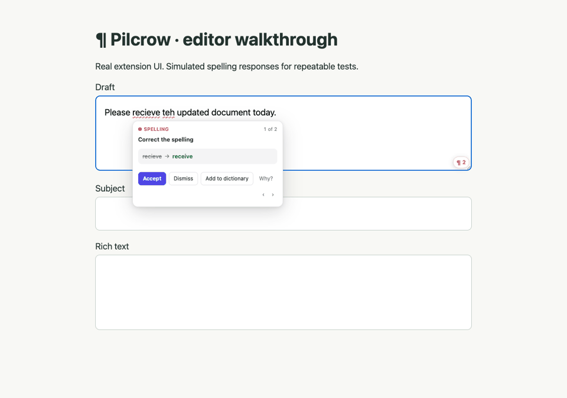
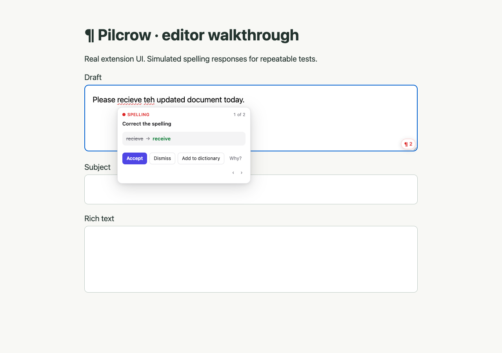
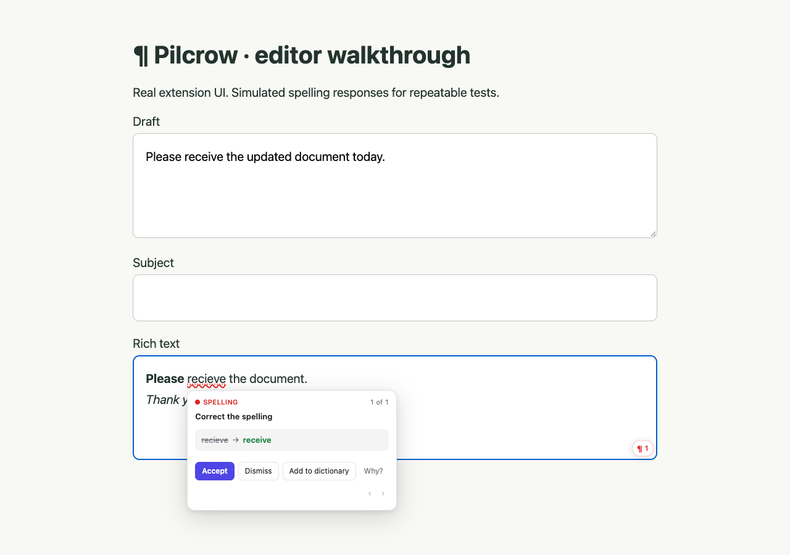

# ¶ Pilcrow

Pilcrow is a writing assistant for Chrome that I started as a personal project
and have now opened up. It checks spelling, grammar and punctuation, and has a
few writing tools like rewrites, translation and summaries. It uses Chrome's
built-in Gemini Nano APIs.

I wanted the writing itself to stay on the device. Pilcrow has no application
backend or analytics, and model requests are intended to run locally once the
models are downloaded. Settings may sync through your Google account. I have
not yet finished verifying offline behavior with the real models or checking
network traffic across the whole browser; see [measurement status](benchmarks/README.md).

[Download the latest release](https://github.com/MahalParida/pilcrow/releases/latest)
· [MIT license](LICENSE) · [What the tests cover](tests/README.md)

## Demo

[Watch the UI walkthrough](docs/media/ui-demo.webm) ·
[Download the video](https://github.com/MahalParida/pilcrow/raw/refs/heads/main/docs/media/ui-demo.webm)



The walkthrough uses the real extension UI and messaging, with a simulated
engine returning predictable suggestions. It shows how the interactions work;
it says nothing about model accuracy or speed. To record it again, run
`npm run demo:record`.

| Inline suggestions | Rich-text editing |
| --- | --- |
|  |  |

The images in `store/` are listing artwork, not screenshots of a live model.

## Requirements

| | |
|---|---|
| Chrome | 138 or newer, **desktop only** |
| Disk | ~22 GB free (one-time model download) |
| GPU | more than 4 GB VRAM, **or** a 4-core CPU with 16 GB RAM |
| OS | Windows 10/11, macOS 13+, Linux, ChromeOS |

## Install the release

Download `pilcrow-1.0.0.zip` from [GitHub Releases](https://github.com/MahalParida/pilcrow/releases),
unzip it into a permanent folder, open `chrome://extensions`, enable
**Developer mode**, and choose **Load unpacked** with that folder. Download the
models from the extension popup. This is an unpacked developer installation;
I haven't published Pilcrow to the Chrome Web Store, so this is a local
developer installation.

## Install from source

```bash
npm install
npm run build
```

Then in Chrome:

1. Open `chrome://extensions`
2. Turn on **Developer mode** (top right)
3. Click **Load unpacked** and select the `dist/` folder
4. Open the Pilcrow popup and click **Download the model now**, or use
   **Settings → Model status → Download models** to fetch everything at once

> Chrome requires a direct click to start a model download. Start it from the
> popup or options page; a background task cannot do it for you.

## Optional: enable the specialised APIs

Three of Chrome's writing APIs are still behind flags. Pilcrow falls back to
the general Prompt API without them. The specialised APIs can be faster, and
Proofreader returns exact character offsets instead of text that Pilcrow has to
find in the original.

```
chrome://flags/#proofreader-api   → Enabled
chrome://flags/#rewriter-api      → Enabled
chrome://flags/#writer-api        → Enabled
```

Restart Chrome. The options page shows which APIs are live.

## Features

- Inline wavy underlines for spelling, grammar and punctuation
- Clarity, conciseness and word-choice suggestions
- Tone detection (up to three tones with confidence)
- Full-text rewriting with tone and length controls
- A 0–100 writing score broken into correctness, clarity, engagement, delivery
- Writing goals — audience, formality, domain, intent — that steer every check
- Personal dictionary, per-site disabling, snippets with typed triggers
- Word/character/sentence counts, reading and speaking time, Flesch reading
  ease, Flesch–Kincaid grade level, passive-voice ratio
- Supports `<input>`, `<textarea>` and `[contenteditable]`. Some complex
  third-party editors still need compatibility testing.

- **On-device model calls.** Writing is processed by Chrome’s built-in models;
  see the measurement status above for what I have and haven't verified.
- **Translate** any field or selection into 20 languages, on device
- **Summarise** a field or selection (key points, TL;DR, teaser, headline)
- **"Why?"** — an on-demand explanation of any individual suggestion
- **Custom house-style rules** in plain English, enforced on every check and
  reported under a "Style" category
- **Draft & reply** — describe what you want and it writes it, optionally using
  the current field as context
- **Inclusive-language** checks

I haven't added plagiarism detection. It depends on searching a large corpus,
which doesn't fit the local-only direction of this project.

## Keyboard shortcuts

| Shortcut | Action |
|---|---|
| `Alt+Shift+W` | Open the popup |
| `Alt+Shift+C` | Recheck the focused field |
| `Alt+Shift+A` | Accept the first suggestion |
| `Esc` | Close the suggestion card |

## How it works

```
content script ─┐                       ┌─▶ offscreen document ──▶ Chrome built-in AI
side panel ─────┼─ port RPC ─┐          │     engine + session pool     (Gemini Nano)
popup / options ┘            │          │
                             ▼          │
                      service worker ───┘
                   (router, menus, commands,
                    keeps the offscreen doc alive)

popup / options / side panel ─────────────▶ Chrome built-in AI
        model downloads only, in-page, on click
```

**Why I use an offscreen document.** Chrome's built-in AI APIs are not exposed to Web
Workers — the Prompt API, Summarizer, Translator and Language Detector all carry
that restriction — and an extension service worker *is* a worker, so every one of
those globals is `undefined` there. The engine therefore lives in an offscreen
document, which is a real `Window`. The service worker keeps it alive and does
nothing model-related.

**The offscreen document may only use `chrome.runtime`.** No `chrome.storage`,
no `chrome.tabs`. Touching one throws during module evaluation, which leaves the
document's listeners unregistered — so every port opened against it fails with
"Receiving end does not exist", a symptom that points nowhere near the cause.
Settings and the personal dictionary therefore travel *with* each `analyze`
call, and the service worker relays setting changes so warm sessions can be
dropped. `npm run check:contexts` fails the build if any bundle reaches for an API
its context does not have.

**Waiting for the engine.** `createDocument()` resolves before the
document's deferred module script has run, so the worker polls a ping message
and only reports the engine ready once it answers.

**Why downloads start from the UI.** Chrome requires transient user
activation before it will fetch a model, and activation does not survive a
`chrome.runtime` message hop. So the popup, options page and side panel start
downloads *in their own page* at the moment you click, then hand the actual
inference off to the offscreen engine, which by then finds the model ready.

**Editor adapters.** `[contenteditable]` is underlined with the CSS Custom
Highlight API, which decorates ranges without inserting any DOM nodes — critical,
because injecting wrappers into a rich-text editor corrupts its internal model.
`<input>` and `<textarea>` keep their text out of the DOM, so those get a
pixel-aligned mirror element with transparent text and visible underlines.

**Anchoring.** The Prompt API is asked for structured JSON (via
`responseConstraint`) quoting the original text verbatim per numbered sentence.
Each quote is then located inside that sentence's character range, degrading
through exact → case-insensitive → whitespace-normalised matching. Anything that
cannot be located is dropped rather than guessed at. When the Proofreader API is
available its exact offsets win any overlap.

**Sessions.** One warm session per system prompt is kept in the offscreen
document and cloned per request, so the system prompt is paid for once but no request
pollutes the next one's context. A live port from the content script keeps the
service worker from being shut down mid-inference.

**Known rough edge.** `chrome.offscreen` has no `reasons` value that describes
"the AI API needs a DOM context", so the document is declared with `WORKERS` and
an honest justification string. If Chrome adds a better-fitting reason, switch to
it. This mismatch is disclosed to Web Store reviewers rather than left to be
noticed — see the offscreen entry in [store/SUBMISSION.md](store/SUBMISSION.md).

## Diagnostics

Open **Settings → Diagnostics → Run diagnostics**. It sends a request
through every layer (this page → service worker → offscreen engine → model, plus
the content script on your current tab) and prints exactly which one failed, with
timings. **Copy report** puts the whole thing on the clipboard.

## Troubleshooting

**"Could not establish connection. Receiving end does not exist."**

The engine host was not reachable. In order of likelihood:

1. **You reloaded the extension but not the page.** A content script injected
   before the reload has a dead extension context. Refresh any tab you want to
   use Pilcrow in — reloading the extension is not enough.
2. **The manifest changed and the extension was not reloaded.** The `offscreen`
   permission was added; go to `chrome://extensions` and hit reload on Pilcrow.
3. **The offscreen document failed to start.** Open `chrome://extensions` →
   Pilcrow → *Inspect views: offscreen/index.html*. If that entry is missing,
   the document never launched. The usual cause is code in that bundle touching
   an extension API other than `chrome.runtime` — run `npm run check:contexts`,
   which fails with the exact file and line.

**Errors about unsupported languages**

Chrome's APIs each accept a narrow set. The Proofreader is English-only and
aborts the request for anything else, so Pilcrow skips that stage on non-English
text and relies on the Prompt API. The Prompt API attests output for
`de, en, es, fr, ja`; for other languages Pilcrow declares nothing rather than
forcing English, because forcing it makes the model translate your text instead
of correcting it. See `src/engine/languages.ts`.

**"Extension context invalidated" in the page console**

The page was open when the extension was reloaded. Pilcrow now detects this and
removes itself from the page cleanly, and the service worker re-injects into
open tabs on update, so this should heal itself — refresh if anything looks
stuck.

**Nothing is ever suggested, and the model status says unavailable**

Open `chrome://on-device-internals` to see whether Chrome considers the device
eligible and whether the model has downloaded. The most common causes are less
than 22 GB free disk space, or being on a metered connection.

**Translation never downloads**

Downloads require a real click. Use **Settings → Model status → Download
models**, which lists each API with either Ready or the specific reason it
failed. Language packs are per-pair, so `en → es` downloading does not mean
`en → ja` has.

## Development

```bash
npm run typecheck        # tsc --noEmit
npm run test             # 67 checks on offsets, anchoring, stats, scoring
npm run build            # writes dist/
npm run check:contexts   # asserts each bundle only uses APIs its context has
npm run check            # all four
npx playwright install chromium # one-time browser install
npm run test:e2e         # 9 browser tests; builds first
npm run icons       # regenerate the PNG icons

npm run dev:main    # watch build for background + panels
npm run dev:content # watch build for the content script (run in a second shell)
```

The content script is built separately because content scripts cannot be ES
modules and must ship as one self-contained IIFE.

`npm run check:contexts` is worth knowing about: each of the four execution
contexts exposes a different slice of the platform, and violations fail in a
place far from their cause. It walks every bundle's import graph and rejects any
`chrome.*` API the context does not have.

`npm run test` covers the DOM-free logic — sentence splitting with exact
offsets, suggestion anchoring, dictionary and category filtering, proofreader
precedence, statistics and scoring. `npm run test:e2e` adds nine Chromium tests
for editor adapters, correction UI, stale results, rich-text undo, excluded
password fields, offline UI behavior with a simulated engine, and persistent
settings/dictionary using the unmodified extension. See [test scope and limitations](tests/README.md).

Real-model latency, memory, accuracy and offline/network results are not yet
reported. The [measurement protocol and 12-case dataset](benchmarks/README.md)
make the remaining work explicit; synthetic tests are not used as AI benchmarks.

## CI and releases

[GitHub Actions](.github/workflows/ci.yml) runs on branch pushes, pull requests,
version tags, and manual dispatch. It uses Node.js 22 and `npm ci`, then runs
`npm run package`: type checking, tests, both builds, extension-context checks,
and ZIP packaging, followed by the Chromium browser suite. Successful runs keep a `pilcrow-extension` artifact for 14 days.

To publish a GitHub Release, keep the versions in `package.json`,
`package-lock.json`, and `public/manifest.json` aligned, commit and push the
changes, then push a matching tag:

```bash
git tag v1.0.0
git push origin v1.0.0
```

The tag must match `package.json` (with a `v` prefix). After the checks pass,
the workflow creates a GitHub Release with generated notes and the extension ZIP.
It uses the built-in `GITHUB_TOKEN`; no additional secrets are required.
Upload the ZIP to the Chrome Web Store manually; this workflow does not submit it.

## Layout

```
public/            manifest.json, page-level CSS, generated icons
src/shared/        types, storage, port RPC, text utilities, statistics
src/engine/        capability probing, session pool, and one module per feature
src/content/       editor adapters, controller, shadow-DOM overlay
src/offscreen/     the engine host — every model call happens here
src/background/    service worker: offscreen lifecycle, context menus, commands
src/sidepanel/     suggestions, tools and insights
src/options/       settings, dictionary, snippets, style rules
src/popup/         status and quick toggles
```

## License

[MIT](LICENSE). Chrome and its built-in models are separate software and are not covered by this license.
